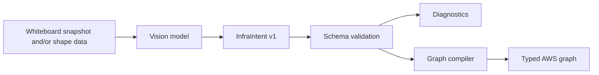
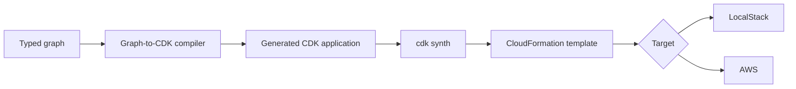
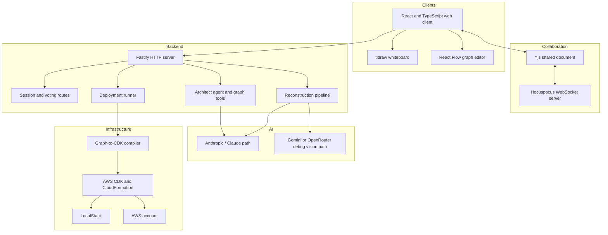

# VibeCloud — Product, Technical, Differentiation, and Hackathon Demo Documentation

**Document status:** Draft for product planning, repository documentation, Devpost copy, and hackathon presentation  
**Product stage:** Functional hackathon prototype  
**Recommended public name:** **VibeCloud**  
**Recommended tagline:** **Sketch. Agree. Architect. Deploy.**

> **Accuracy note:** This document separates the current prototype from recommended product evolution. The current-state sections are based on the public VibeCloud Devpost submission, repository README and shared contracts, and supplied product screenshots. Features under “Recommended” or “Roadmap” should not be presented as already implemented.

---

## 1. Executive summary

VibeCloud is a multiplayer, AI-assisted cloud architecture workspace that helps a team move from an informal whiteboard discussion to a structured AWS architecture and a deployable infrastructure plan.

Most cloud projects begin with business requirements and rough sketches, but then fragment across unrelated tools:

1. Domain experts explain the workflow.
2. A team sketches the idea on a whiteboard.
3. A cloud architect redraws it with AWS symbols.
4. Engineers translate the design into infrastructure as code.
5. A separate deployment process creates the actual cloud resources.

Each handoff introduces delay, ambiguity, and lost context. VibeCloud brings those activities into one shared room. Team members can create or join a session, brainstorm on a collaborative whiteboard, vote when the group is ready, reconstruct the sketch into a typed AWS graph, review or edit the architecture with an AI agent, and deploy an approved graph through AWS CDK to LocalStack or AWS.

The product is not best positioned as “another cloud diagram editor.” Its strongest differentiation is the transition from **messy, cross-functional collaboration** to a **structured and reviewable infrastructure model**.

### One-sentence description

**VibeCloud turns a live team whiteboard into a typed, AI-reviewed AWS deployment plan without losing the people, requirements, and decisions behind the architecture.**

### Thirty-second pitch

Cloud architecture is usually a sequence of disconnected handoffs: business teams describe a process, someone sketches it, an architect redraws it, and an engineer eventually writes infrastructure code. VibeCloud replaces those handoffs with one multiplayer workspace. A team sketches the system together, reaches consensus, uses AI to reconstruct the sketch into a typed AWS graph, reviews changes through an architect agent, and deploys the approved design through AWS CDK. We start before traditional infrastructure tools do—when the team still has a business idea rather than a finished cloud specification.

---

## 2. The problem

### 2.1 Cloud design begins before cloud terminology

A warehouse manager, clinician, factory operator, logistics coordinator, or finance analyst may understand the required workflow better than anyone else on the project. That person may not know whether the implementation should use EC2, Lambda, SQS, DynamoDB, RDS, or another service.

Traditional infrastructure tools normally begin with a resource palette or code editor. That assumes the architecture has already been decided. In reality, the most consequential work often happens earlier:

- What is the customer trying to do?
- Which steps are business-critical?
- Where can work be asynchronous?
- What data is sensitive?
- What happens when a system is unavailable?
- Which decisions require human approval?
- What volume, latency, availability, and recovery requirements apply?

VibeCloud gives nontechnical and technical participants a common starting point: a visual workflow.

### 2.2 Existing workflows lose context

A common process looks like this:

```text
Meeting notes
→ whiteboard
→ architecture diagram
→ chat discussion
→ infrastructure code
→ deployment
```

The artifacts rarely remain synchronized. The final infrastructure may not reflect the original business intent, and the business team may not understand why new technical components appeared.

### 2.3 Static diagrams are not operational models

A diagram can look correct while remaining semantically ambiguous. A box may represent an application, a server, a cluster, a service, or an entire environment. Lines may represent data flow, containment, network access, or dependency.

VibeCloud converts the visual discussion into a typed graph with explicit resource types and relationships. This creates a machine-readable layer that can be validated, edited by tools, and compiled into deployment artifacts.

### 2.4 Generative AI needs control boundaries

An AI model can produce plausible architecture suggestions, but cloud deployment is a high-impact action. VibeCloud’s product direction should therefore preserve human control through:

- Team readiness gates
- Typed graph operations
- Schema validation
- Explicit versus inferred resource metadata
- Approval-gated topology upgrades
- A sandbox deployment target
- Separate deployment authorization for production

---

## 3. Product vision

VibeCloud should become the collaborative decision layer between business discovery and infrastructure delivery.

```text
Domain knowledge
→ collaborative visual reasoning
→ structured architecture proposal
→ validation and approval
→ infrastructure delivery
```

The product’s long-term goal is not to remove architects or platform engineers. It is to reduce low-value translation work, expose assumptions earlier, and allow each participant to contribute in the language of their discipline.

### Product principles

#### Start loose, become structured

A team should be able to begin with rough boxes, arrows, labels, and notes. Structure is introduced only after the group is ready.

#### Keep humans in control

AI proposes, explains, critiques, and applies reviewable graph operations. It should not silently deploy production infrastructure.

#### Preserve why, not only what

The architecture should retain its requirements, assumptions, unresolved questions, votes, and decisions.

#### Make technical output understandable

Every generated resource should be explainable in business language: what it does, why it exists, what requirement it supports, and what happens if it fails.

#### Prefer safe iteration

LocalStack and synthesis should be the default demonstration and prototyping path. Real AWS deployment should require explicit authorization and review.

---

## 4. Target users

| User | What they contribute | What VibeCloud gives them |
|---|---|---|
| Business sponsor | Outcome, budget, priority, risk tolerance | Visibility into what is being built and why |
| Product manager | User workflow and requirements | A bridge from product intent to architecture |
| Domain expert | Real operational process and exceptions | A way to participate without AWS knowledge |
| Cloud architect | Service selection and system tradeoffs | Faster conversion from workshop to formal design |
| Software engineer | Application behavior and integrations | A structured graph connected to implementation |
| Platform/DevOps engineer | Deployment, environments, observability | A path to CDK and deployable infrastructure |
| Security/compliance reviewer | Data, access, audit, policy constraints | Early review before deployment |
| Consultant/facilitator | Workshop structure and client alignment | A shared deliverable and decision trail |
| Educator/student | Architecture learning and experimentation | Visual progression from concept to cloud resources |

---

## 5. Primary use cases

### 5.1 Cross-functional architecture workshop

A facilitator creates a room. Business and operations participants draw the current and desired workflow. Engineers add integrations and constraints. The group votes to formalize the design, reviews the generated architecture, and records unresolved questions.

### 5.2 Rapid cloud prototype

A small engineering team sketches an application, reconstructs it into AWS resources, asks the architect agent for improvements, and deploys the result to LocalStack for a fast proof of concept.

### 5.3 Architecture review

A cloud architect imports or recreates a proposed system graph. Security, reliability, and cost reviewers annotate the design. The agent explains tradeoffs and applies approved modifications.

### 5.4 Client discovery for traditional industries

A manufacturing, logistics, healthcare, construction, retail, or distribution team describes its business process visually. VibeCloud converts that domain knowledge into a technical proposal that a cloud specialist can validate.

### 5.5 Cloud education

Students begin with a workflow rather than memorized service icons. They can see how availability, traffic, recovery, and audience requirements alter a cloud topology.

---

## 6. End-to-end user journey

### 6.1 Landing and workspace setup

The landing page presents the core promise: design cloud systems together.

A user can:

- Enter a display name
- Choose a cursor color
- Create a shared session
- Join an existing session using a link or ID
- Work alone with local persistence

This onboarding is intentionally low-friction. It gives the workspace a human identity before introducing technical architecture.

### 6.2 Phase 1: collaborative whiteboard

The first phase uses a freeform tldraw canvas. Participants can draw:

- Users and external actors
- Business functions
- Applications and integrations
- Data stores
- Queues or asynchronous work
- Trust boundaries
- Requirements and constraints
- Failure paths
- Questions and assumptions

The objective is not to create a perfect AWS diagram. It is to capture the team’s shared mental model.

### 6.3 Presence and real-time collaboration

Shared sessions use Yjs-backed state and Hocuspocus collaboration. Participants see each other through names, cursor colors, and live updates.

The collaboration layer allows the architecture to be created as a conversation rather than passed around as a file.

### 6.4 Readiness vote

The current prototype uses an 80 percent vote threshold to move from the whiteboard into the architecture phase.

The vote is valuable because it makes a phase transition explicit:

> “The team agrees that this sketch is complete enough to formalize.”

This vote should be described as design consensus, not production authorization.

### 6.5 Sketch-to-architecture reconstruction

The reconstruction pipeline interprets the board and turns it into a compact infrastructure intent.

A strong conceptual pipeline is:



The current repository includes a standalone `/debug` parser bench that:

1. Captures a board snapshot.
2. Sends it to a configured vision provider.
3. Validates a compact infrastructure schema.
4. Compiles the result into the shared graph contract.
5. Collects workload requirements.
6. Selects a workload stage.
7. Produces a staged deployment plan.

The provider layer is configurable. The repository contains Anthropic/Claude agent paths and a debug reconstruction path supporting Gemini or OpenRouter, with Gemini configured as the default debug provider.

### 6.6 Requirements profile

The shared contracts define a requirements profile that can describe:

- Audience: internal or external
- Criticality: noncritical or business-critical
- Expected user band: tiny, small, medium, or large
- Traffic: low, moderate, high, or very high
- Burstiness: steady or bursty
- Whether the workload has asynchronous work
- Availability: best effort, standard, or high
- Recovery urgency: flexible, same day, or urgent

This is a significant product opportunity. It allows VibeCloud to explain why two visually similar applications may require different infrastructure.

### 6.7 Workload-stage decision

The current contracts support four workload stages:

- Prototype
- MVP
- Growth
- Production

The stage decision includes confidence, reasons, whether approval is required, and proposed upgrades.

For example:

```text
The sketch explicitly contains one application server.

Requirements:
- External users
- Business-critical
- Bursty traffic
- High availability

Suggested stage:
- Growth

Approval-gated upgrades:
- Add a load balancer
- Add multiple application instances
- Separate public and private network zones
```

This makes the AI’s inferred changes visible rather than silently inserting them.

### 6.8 Deployment plan and resource provenance

Deployment-plan metadata distinguishes three origins:

- `explicit`: directly represented in the source intent
- `inferred-minimal`: necessary to make the design deployable
- `stage-upgrade`: added because of workload-stage requirements

The future UI should display these origins directly on nodes and in a review panel. That would let users answer:

- Did we draw this?
- Did VibeCloud infer it?
- Why is it required?
- Does it need approval?

### 6.9 Phase 2: typed architecture graph

The structured architecture editor uses React Flow. It presents:

- A node library of supported resources
- A typed resource graph
- Labeled relationships
- Architecture chat
- Chat history
- LocalStack and AWS deployment actions
- Team voting status

Unlike the whiteboard, this phase is intended to be machine-readable and deployment-oriented.

### 6.10 Architect agent

The architect chat can critique the design and edit the graph through tool use.

Recommended agent responsibilities include:

- Explain the architecture in plain language
- Identify missing components
- Suggest security, reliability, scalability, and cost improvements
- Ask clarifying questions when the sketch is ambiguous
- Apply typed node and edge changes
- Show a proposed diff before committing high-impact changes
- Record the rationale for every modification

The agent should operate on the graph contract rather than generating arbitrary shell commands or unreviewed infrastructure code.

### 6.11 Deployment vote

The current session contract supports separate vote kinds for:

- Readiness to enter architecture mode
- Deployment to LocalStack
- Deployment to AWS

A second 80 percent vote is used by the prototype deployment flow.

For a production product, team consensus and cloud authorization should be separated. A team can agree on the design, but only an authorized deployer should be able to execute an AWS change.

### 6.12 Synthesis and deployment

The deployment layer translates the graph into AWS CDK and can synthesize or deploy the resulting stack.



LocalStack is the preferred hackathon demonstration target because it is fast, repeatable, and does not expose a real AWS account to an experimental model-generated architecture.

The supplied project evidence also shows a real AWS CloudFormation stack containing generated resources, which is useful as proof that the project goes beyond a static diagram.

---

## 7. Current shared data model

### 7.1 Graph contract

The shared graph contains nodes and edges.

```ts
interface GraphNode {
  id: string;
  type: AwsResourceType;
  label: string;
  position: { x: number; y: number };
  props?: Record<string, string | number | boolean>;
}

interface GraphEdge {
  id: string;
  source: string;
  target: string;
  label?: string;
}

interface Graph {
  nodes: GraphNode[];
  edges: GraphEdge[];
}
```

### 7.2 Supported resource types

The current shared contract includes:

- External actor/application
- EC2
- S3
- Lambda
- RDS
- DynamoDB
- VPC
- Subnet
- Security Group
- Internet Gateway
- NAT Gateway
- Route Table
- API Gateway
- SNS
- SQS
- IAM Role
- CloudFront
- Elastic Load Balancer
- MSK

This is sufficient for a focused hackathon demo. It should not be described as complete AWS coverage.

### 7.3 Session contract

A session contains:

- Session ID
- Join URL
- API-key availability state
- Current phase
- Members
- Creation time

The current phases are:

```text
phase1 → phase2 → deployed
```

Deployment targets are:

```text
localstack | aws
```

### 7.4 Recommended evolution of the architecture model

The current graph is intentionally simple. A production model should separate semantic infrastructure from canvas layout.

```ts
interface Architecture {
  schemaVersion: string;
  resources: Resource[];
  relationships: Relationship[];
  requirements: RequirementsProfile;
  decisions: ArchitectureDecision[];
  unresolvedQuestions: Question[];
  revisions: Revision[];
}

interface Resource {
  id: string;
  type: string;
  name: string;
  properties: Record<string, unknown>;
  origin: "explicit" | "inferred-minimal" | "stage-upgrade";
  confidence?: number;
  approvalStatus: "not-required" | "pending" | "approved" | "rejected";
}
```

React Flow positions should be stored in a separate view model. CDK should be generated deterministically from the semantic model.

---

## 8. Technical architecture



### 8.1 Frontend

- React and TypeScript
- Current repository documented as a Vite SPA
- Tailwind-based styling
- tldraw for freeform ideation
- React Flow for structured architecture
- Custom visual identity with serif typography, orange dither textures, rounded surfaces, and participant cursor colors

### 8.2 Collaboration

- Yjs shared state
- Hocuspocus WebSocket server
- Multiplayer presence and synchronized phases
- Local persistence for solo sessions

### 8.3 Backend

- Fastify HTTP APIs
- Session and collaboration plumbing
- Reconstruction and parser flows
- Agent requests and typed graph tools
- CDK build, synth, and deployment runners

### 8.4 AI layer

The repository contains more than one provider path:

- Anthropic/Claude for the primary agent and reconstruction path described by the README
- Gemini or OpenRouter for the standalone debug vision pipeline
- Configurable model selection through environment variables

This provider abstraction is useful, but the public documentation should consistently explain which provider is used in the main demo.

### 8.5 Infrastructure layer

- AWS CDK
- CloudFormation
- LocalStack
- Docker Compose
- Nginx/VPS deployment support in the repository

### 8.6 Repository layout

```text
shared/          Shared graph, session, chat, history, and infra contracts
web/             React web application
server/          Fastify, Hocuspocus, agents, reconstruction, and deployment
nginx/           Static hosting and reverse-proxy configuration
docker-compose   Backend, Nginx, and LocalStack orchestration
```

---

## 9. Local development

### Prerequisites

- Node.js and npm
- Docker and Docker Compose
- At least one supported AI provider key
- Optional AWS credentials only when intentionally testing real AWS deployment

### Start the prototype

```bash
npm install

npm run dev:localstack
npm run dev:server
npm run dev:web
```

Expected local services:

```text
LocalStack:       http://localhost:4566
HTTP backend:     http://localhost:3000
Collaboration WS: ws://localhost:3001
Web application:  http://localhost:5173
Debug parser:     http://localhost:5173/debug
```

### Relevant environment configuration

```text
ANTHROPIC_API_KEY
GOOGLE_API_KEY
OPENROUTER_API_KEY
DEBUG_VISION_PROVIDER
GEMINI_MODEL
LOCALSTACK_INTERNAL_URL
LOCALSTACK_PUBLIC_URL
```

The current README documents Gemini as the default debug provider and allows OpenRouter as an alternative. The repository pins a stable LocalStack image rather than relying on `latest`.

### Documentation consistency issue to fix

The Devpost description references Next.js, while the current repository README describes the web app as a Vite + React SPA. Before the next hackathon, update the public copy so the technology stack is consistent everywhere.

---

## 10. Differentiation

### 10.1 Strategic position

VibeCloud should own the space between a business workshop and an infrastructure-as-code editor.

```text
Miro / whiteboard tools
        ↓
     VibeCloud
        ↓
AWS Infrastructure Composer / CDK / Terraform workflows
```

It is strongest at the moment when:

- The system is not yet formally defined
- Multiple disciplines need to contribute
- Requirements are still ambiguous
- A rough drawing must become a machine-readable architecture
- The team needs to agree before implementation begins

### 10.2 Differentiation pillars

#### 1. Progressive formalization

Most cloud tools begin with formal resources. VibeCloud begins with a rough collaborative sketch and introduces structure through an explicit phase transition.

#### 2. Cross-functional participation

A domain expert can draw “supplier portal,” “inventory,” or “nurse alert” without knowing AWS service names. Technical participants can formalize the result later.

#### 3. Multiplayer consensus as part of the workflow

Presence, shared editing, and voting are not peripheral features. They define how the design advances.

#### 4. Multimodal sketch-to-typed-graph transformation

The AI does not only create a picture. It produces a compact intent, validates it, and compiles it into typed resources and relationships.

#### 5. Requirements-aware architecture staging

The workload questionnaire connects business requirements to infrastructure topology. Prototype, MVP, growth, and production designs should not be treated as identical.

#### 6. Explainable resource provenance

The deployment model can distinguish resources drawn by the user, minimally inferred resources, and stage-driven upgrades requiring approval.

#### 7. Agentic graph editing

The architect agent can critique and modify the structured graph through tools rather than only returning prose.

#### 8. End-to-end deployment proof

The flow reaches CDK, CloudFormation, LocalStack, and potentially AWS. This distinguishes VibeCloud from tools that stop at presentation diagrams.

#### 9. Safe sandbox-first iteration

LocalStack gives teams a practical place to test generated infrastructure before using a real cloud account.

### 10.3 Competitive context

| Product category | Primary strength | Where VibeCloud should differentiate |
|---|---|---|
| AWS Infrastructure Composer | AWS-native visual composition synchronized with CloudFormation/SAM | VibeCloud starts earlier, with freeform team ideation, nontechnical participants, and explicit consensus |
| Brainboard | Mature multi-cloud Terraform lifecycle, policy, cost, GitOps, and infrastructure management | VibeCloud focuses on discovery workshops and converting ambiguous team input into a first structured proposal |
| Eraser | AI diagrams, documentation, diagram-as-code, and real-time technical collaboration | VibeCloud adds a typed AWS resource model, workload staging, approval gates, and a CDK deployment path |
| Cloudcraft | High-quality AWS/Azure visualization, environment understanding, and cost communication | VibeCloud emphasizes collaborative creation and transformation from rough workflow to deployable model |
| Generic whiteboards | Flexible brainstorming and broad participation | VibeCloud adds cloud semantics, AI reconstruction, validation, and infrastructure delivery |
| Direct prompt-to-IaC tools | Fast generation from text | VibeCloud preserves shared visual reasoning, requirements, votes, and human review |

### 10.4 What not to claim

Do not claim that VibeCloud is currently:

- A complete replacement for AWS Infrastructure Composer
- A production-grade Terraform or CDK governance platform
- A full AWS service catalog
- A safe autonomous production deployer
- More mature than enterprise platforms such as Brainboard
- Guaranteed to generate correct architecture from every sketch

### 10.5 Recommended positioning statement

> **VibeCloud is a multiplayer architecture decision workspace that turns rough team sketches into validated AWS proposals and reviewable deployment plans.**

### 10.6 Messaging by audience

**For judges**

> We combine multiplayer whiteboarding, multimodal AI, a typed infrastructure compiler, and AWS deployment in one phase-gated workflow.

**For business teams**

> Explain the system visually in your own language. VibeCloud helps turn the workflow into a technical plan your engineers can review.

**For engineers**

> Convert collaborative sketches into a typed AWS graph, refine it through agent tools, and compile it to CDK.

**For cloud architects**

> Reduce the manual translation between discovery workshops, formal diagrams, architecture review, and infrastructure handoff.

---

## 11. Recommended hackathon demo scenario

### Scenario: A manufacturer launches a supplier document portal

A regional manufacturer currently collects supplier insurance certificates, safety documents, and product files by email. Operations needs a portal before an upcoming audit, but the operations team does not know how to design AWS infrastructure.

### Demo participants

- **Operations manager:** understands the process and requirements
- **Cloud engineer:** understands architecture and deployment

Use two browser profiles so judges can see genuinely separate participants.

### Initial whiteboard

The operations manager draws:

```text
Supplier
→ web portal
→ document review
→ file storage
```

The cloud engineer adds:

```text
- External users
- Bursty usage before audit deadlines
- Business-critical
- Private document storage
- High availability
```

### Expected structured architecture

The reconstruction can produce a design similar to the supplied project evidence:

```text
External users
→ Elastic Load Balancer
→ multiple EC2 application instances
→ S3 document storage

Supporting infrastructure:
- VPC
- Public/private subnet boundaries
- Security group
- Internet/networking resources
- IAM role where supported
```

This scenario is effective because:

- A nontechnical participant can understand it
- It demonstrates real collaboration
- It maps cleanly to the current resource catalog
- It shows why workload requirements change topology
- It can be deployed to LocalStack
- The AWS CloudFormation screenshot provides a strong final proof point

---

## 12. Two-to-three-minute hackathon video script

The original hackathon required a two-to-three-minute demo video. Target approximately **2 minutes 45 seconds**.

### 0:00–0:15 — Problem and hook

**Narration**

> Traditional companies know their workflows, but cloud projects still pass through a whiteboard, an architect, an infrastructure engineer, and a separate deployment tool. Every handoff loses context. VibeCloud turns that entire process into one shared room.

**On screen**

- Landing page
- Product tagline
- Click **Start building**

### 0:15–0:35 — Create a multiplayer room

**Narration**

> An operations manager creates a workspace and shares the session link. A cloud engineer joins from another browser, chooses a cursor color, and both participants immediately work on the same canvas.

**On screen**

- Enter two names in separate browser windows
- Create session
- Join session
- Move both cursors briefly so collaboration is unmistakable

### 0:35–0:58 — Sketch in business language

**Narration**

> Operations does not need AWS knowledge. They sketch the business flow: suppliers use a portal, employees review documents, and the files are stored securely. The engineer adds the requirements that matter: external users, bursty traffic, high availability, and private storage.

**On screen**

- Draw four simple labeled boxes
- Add two short requirement notes
- Avoid detailed drawing; keep it legible

### 0:58–1:10 — Team consensus

**Narration**

> When the team believes the idea is complete enough, both members vote. At the readiness threshold, VibeCloud moves from creative whiteboarding into structured architecture.

**On screen**

- Both users vote
- Show progress reaching the threshold
- Trigger reconstruction

### 1:10–1:38 — AI reconstruction and staged plan

**Narration**

> VibeCloud sends the board to a vision model, validates the returned infrastructure intent, and compiles it into a typed AWS graph. Requirements drive a workload-stage decision, so VibeCloud can distinguish what the team explicitly drew from minimal infrastructure and higher-availability upgrades that require approval.

**On screen**

- Brief loading state
- Show graph appearing
- Focus on the load balancer, EC2 instances, VPC, subnets, security group, and S3
- If the stage/provenance UI is not complete, narrate only the features that are visibly demonstrated or show the `/debug` plan panel

### 1:38–2:02 — Architect agent

**Narration**

> The team can now ask the architect agent to explain or modify the system. Instead of returning only text, the agent uses typed tools to edit the shared graph. Here we ask it to explain the design for operations and confirm that document storage is protected.

**On screen**

- Use a short prewritten prompt
- Show the explanation
- Show one deterministic graph edit or highlighted recommendation

### 2:02–2:30 — Deploy

**Narration**

> Once the team approves the architecture, they vote to deploy to LocalStack. VibeCloud compiles the graph into AWS CDK, synthesizes CloudFormation, and creates the infrastructure in a safe local AWS environment.

**On screen**

- Both users vote for LocalStack
- Show deployment progress
- Show successful resources or inspector output

### 2:30–2:45 — Proof and differentiation

**Narration**

> We also validated the flow against AWS CloudFormation. VibeCloud is not just an AI diagram generator. It begins with a live team discussion, turns the result into typed infrastructure, preserves approval, and carries the design to deployment.

**On screen**

- CloudFormation stack screenshot
- Final title card:
  **Sketch. Agree. Architect. Deploy.**

---

## 13. Five-minute live judging demo

### Minute 0–1: Establish the problem

Explain the fragmented handoff and introduce the supplier-portal scenario. Do not begin with the technology stack.

### Minute 1–2: Prove collaboration

Create or open the room in two browser profiles. Move both cursors, add different elements, and show that both clients update.

### Minute 2–3: Prove transformation

Vote, reconstruct the board, and show the typed architecture. Explain the difference between a whiteboard object and an AWS resource node.

### Minute 3–4: Prove intelligence

Ask one strong question:

> “Explain this architecture to the operations manager and make it resilient to an application-instance failure.”

Show a concise response and one visible graph change.

### Minute 4–5: Prove execution and close

Deploy to LocalStack, then show the AWS CloudFormation evidence. Close with differentiation and technical architecture.

---

## 14. Demo reliability plan

Hackathon demos fail most often because the team depends on multiple live systems. VibeCloud depends on browsers, WebSockets, an AI provider, Docker, LocalStack, CDK, and possibly AWS. Build a fallback for every step.

### Required preparation

- Use a tagged and frozen demo commit
- Run the full script repeatedly on the presentation machine
- Use two browser profiles, not two tabs sharing unexpected local state
- Preconfigure server-side provider keys
- Warm the AI request before judging
- Use a small deterministic whiteboard
- Keep prompts in clipboard snippets
- Preload or cache a known-good AI reconstruction
- Start LocalStack before the presentation
- Verify all ports and reverse-proxy routes
- Clear old session and stack state
- Disable auto-updates and notifications
- Keep the CloudFormation screenshot locally available
- Record a complete backup demo video
- Prepare a one-click reset script or documented reset sequence

### Recommended demo modes

#### Mode A: fully live

Use only after the entire flow succeeds reliably in under two minutes.

#### Mode B: live collaboration plus cached AI

The team draws and votes live, but reconstruction can return a stored response for the known demo sketch if the provider times out.

#### Mode C: live product plus recorded deployment

Run collaboration, reconstruction, and graph editing live. Use a short recording for the deployment if CDK/LocalStack is unstable.

Mode B is often the best hackathon tradeoff because it proves the unique interaction while protecting against network latency.

### What to avoid

- Typing a long prompt live
- Drawing a complex architecture
- Using four teammates in the vote demo; an 80 percent threshold means three of four is only 75 percent
- Deploying into a personal production AWS account
- Waiting silently through model or CDK operations
- Explaining every resource
- Spending the first minute on landing-page effects
- Showing unimplemented roadmap features as current functionality

---

## 15. Judging-criteria mapping

### Innovation and creativity

Show the phase transition from freeform collaboration to typed infrastructure. Emphasize that VibeCloud starts before formal cloud design tools.

### Technical complexity

Show the integration of:

- Real-time Yjs/Hocuspocus collaboration
- tldraw whiteboarding
- React Flow graph editing
- Vision-model reconstruction
- Schema validation and graph compilation
- Requirements-aware staging
- Agent tool use
- CDK and CloudFormation deployment

### Design and user experience

Show:

- Memorable landing page
- Low-friction session onboarding
- Participant identity and cursor colors
- Clear phase progression
- Visible vote status
- Side-by-side architecture and chat

### Impact and practicality

Use the traditional-industry scenario. Explain how domain experts can contribute before cloud terminology appears.

### Presentation quality

Tell one coherent story:

```text
Problem
→ two people collaborate
→ team agrees
→ AI formalizes
→ human reviews
→ infrastructure deploys
```

Do not turn the demo into a disconnected feature tour.

---

## 16. Suggested Devpost copy

### Tagline

**A multiplayer AI architecture studio that turns team whiteboards into typed AWS graphs and deployable infrastructure.**

### Inspiration

Cloud systems rarely begin as cloud systems. They begin as conversations between product managers, operations teams, domain experts, architects, and engineers. Today, those conversations are fragmented across whiteboards, diagramming tools, chat threads, infrastructure code, and deployment pipelines. Each handoff loses context.

We built VibeCloud to preserve the creative speed of a whiteboard while giving teams a path toward a structured and deployable architecture.

### What it does

VibeCloud lets teams create shared architecture rooms, choose participant identities and cursor colors, and sketch systems together on a live whiteboard. When the group is ready, an 80 percent vote moves the room into architecture mode.

A vision model reconstructs the sketch into a compact infrastructure intent. VibeCloud validates that intent, compiles it into a typed AWS graph, and allows the team to refine the result through an architect chat agent that can explain and edit the graph using tools. A second approval gate can compile the graph into AWS CDK and deploy it to LocalStack or AWS.

The result is one continuous workflow from messy team idea to structured cloud infrastructure.

### How we built it

The frontend uses React and TypeScript, tldraw for whiteboarding, React Flow for the architecture graph, and Tailwind-based styling. Real-time collaboration uses Yjs and Hocuspocus. Shared TypeScript contracts keep graph, session, history, chat, requirements, and deployment data consistent across the client and server.

The backend uses Fastify for session, AI, reconstruction, and deployment routes. The AI layer supports Anthropic/Claude and a configurable debug vision pipeline using Gemini or OpenRouter. The deployment system converts the graph into AWS CDK, synthesizes CloudFormation, and deploys to LocalStack or AWS.

### Challenges

The hardest problem was balancing freedom with structure. Whiteboards are intentionally ambiguous, while infrastructure must be typed and valid. We introduced a phase-gated workflow so teams can brainstorm freely before the system formalizes their design.

We also had to synchronize multiple kinds of state: collaborative drawing, session presence, voting, phase transitions, graph state, chat history, and deployment progress.

Finally, AI output could not be treated as arbitrary text. We designed compact contracts, validation, graph compilation, and deployment stages so model output could enter a deterministic engineering workflow.

### Accomplishments

- Built a real multiplayer product flow rather than a static prototype
- Connected tldraw collaboration to a typed React Flow architecture
- Implemented AI-assisted reconstruction and graph editing
- Added team voting for phase transitions and deployment
- Generated AWS CDK and CloudFormation from the architecture graph
- Deployed generated infrastructure to LocalStack
- Demonstrated a resulting AWS CloudFormation stack
- Created a distinctive, approachable visual identity

### What we learned

Collaborative technical tools need both freedom and control. Structure introduced too early blocks participation; structure introduced too late produces an unusable artifact. We learned to treat AI as one stage in a validated pipeline rather than the source of truth.

We also learned that nontechnical requirements—audience, criticality, traffic shape, availability, and recovery—are essential inputs to architecture, not secondary documentation.

### What is next

- Better confidence and clarification during sketch reconstruction
- Visible provenance for explicit, inferred, and stage-upgrade resources
- Architecture version history and decision records
- Improved graph layout and relationship semantics
- Cost and policy checks
- CloudFormation change-set review
- Role-based authorization and audit logs
- Reusable industry and architecture templates
- GitHub and existing IaC workflow integration

---

## 17. Security and production-readiness requirements

The current project is a hackathon prototype. Before production use, add:

### Identity and authorization

- Authenticated user accounts
- Workspace membership
- Viewer, editor, reviewer, and deployer roles
- Short-lived WebSocket tokens
- Separate design consensus from AWS deployment authority

### Credential management

- Never place AI or AWS secrets in Yjs documents
- Avoid client-exposed provider keys
- Use server-side secrets management
- Use short-lived assumed AWS roles
- Apply least-privilege permissions

### AI controls

- Treat whiteboard text and chat content as untrusted
- Constrain the agent to typed, allowlisted graph operations
- Validate all model output
- Require confirmation for high-impact changes
- Log model, prompt, proposed patch, approval, and result
- Display uncertainty and ask clarifying questions

### Deployment controls

- Generate and review a CloudFormation change set
- Highlight additions, deletions, and replacements
- Add structural validation and policy-as-code checks
- Estimate cost before deployment
- Require an authorized deployer
- Preserve an audit trail
- Support rollback and cleanup

### Collaboration controls

- Rate limits
- Document-size limits
- Session expiry
- Access checks per room
- Persistent version history
- Backup and recovery
- Audit events

---

## 18. Known limitations

- The AWS resource catalog is currently limited
- Diagram interpretation depends on sketch clarity and model behavior
- The graph contract does not yet express all AWS properties or relationship semantics
- AI-generated changes require stronger visible diff and approval UX
- LocalStack does not perfectly reproduce every AWS behavior
- The current voting model is not a production authorization system
- Graph layout becomes difficult to read with many crossing edges
- Public documentation currently contains a frontend-stack inconsistency
- Long-term persistence, enterprise identity, policy, cost, and audit capabilities are not yet demonstrated
- Real AWS deployment should be treated as experimental until stronger validation is implemented

---

## 19. Recommended roadmap

### Phase 1: make the core demo undeniable

- Stabilize two-user collaboration
- Make reconstruction deterministic for the demo scenario
- Improve automatic graph layout
- Show explicit/inferred/stage-upgrade badges
- Add a clear review screen
- Make LocalStack deployment repeatable
- Align README, Devpost, and presentation stack descriptions

### Phase 2: build trust

- Confidence scores and clarifying questions
- Architecture diff review
- Version history
- Architecture decision records
- Authentication and role-based permissions
- CloudFormation change sets
- Policy and cost validation
- Audit logs

### Phase 3: integrate with engineering workflows

- Export CDK and CloudFormation
- GitHub pull requests
- Import existing templates
- CI validation
- Reusable organization templates
- Comments, assignments, and approval workflows

### Phase 4: expand the platform

- Broader AWS support
- Adapter-based support for additional IaC targets
- Industry-specific requirement templates
- Existing-environment import and drift comparison
- Enterprise governance

Multi-cloud support should not be the immediate priority. VibeCloud should first prove that its collaboration-to-architecture transition is significantly better than existing workflows.

---

## 20. Product success metrics

### Collaboration

- Percentage of sessions with more than one active participant
- Time from room creation to first shared edit
- Percentage of invited users who join
- Number of disciplines represented in a session

### Reconstruction

- Resource-type precision and recall
- Relationship accuracy
- Valid-graph rate
- Percentage of low-confidence elements clarified
- Time spent correcting generated graphs

### Architecture review

- Suggestion acceptance rate
- Number of detected issues before deployment
- Time from sketch to approved architecture
- Number of recorded decisions and unresolved questions

### Deployment

- CDK synthesis success rate
- LocalStack deployment success rate
- AWS deployment success rate in controlled tests
- Cleanup and rollback success rate
- Policy-pass rate

### Business value

- Reduction in architecture handoff time
- Reduction in manual diagram recreation
- Improvement in stakeholder understanding
- Reduction in late requirement changes
- Workshop-to-prototype conversion rate

---

## 21. Frequently asked judge questions

### Why not just use AWS Infrastructure Composer?

Infrastructure Composer is strong once the user is working with AWS resources and CloudFormation. VibeCloud begins earlier, when a cross-functional team still has a rough business workflow. Its focus is collaborative discovery, formalization, and consensus before the infrastructure workflow.

### Why not use Miro or Eraser?

General whiteboards and AI diagram tools are excellent for communication, but VibeCloud’s output is a typed AWS graph connected to workload requirements, approval stages, agent tools, and CDK deployment.

### What exactly does the AI do?

It interprets the board, creates a compact infrastructure intent, supports architecture critique, and can apply typed edits to the graph. Deterministic application logic validates and compiles that output.

### Why use voting?

Voting creates an explicit shared decision that the team is ready to leave the ambiguous whiteboard phase or approve a deployment target. It is a collaboration mechanism, not a substitute for production authorization.

### Why LocalStack?

LocalStack makes the deployment portion fast, safe, repeatable, and inexpensive. It proves that the graph reaches infrastructure execution without putting a real AWS account at unnecessary risk during a demo.

### Is VibeCloud intended for people with no technical knowledge?

Nontechnical participants can express workflows and constraints without selecting cloud resources. A technical reviewer is still required before production deployment.

### What is the most defensible feature?

The most defensible workflow is the progressive transformation from multiplayer business-level sketch to validated, typed, requirements-aware infrastructure with visible human approval.

---

## 22. Final presentation close

> Cloud tools usually begin after the architecture has already been decided. VibeCloud begins where the real design work starts: a group of people trying to understand a system together. We preserve that collaboration, formalize it with AI and typed infrastructure, and carry the approved result to AWS deployment. VibeCloud helps teams sketch, agree, architect, and deploy—from one shared room.
